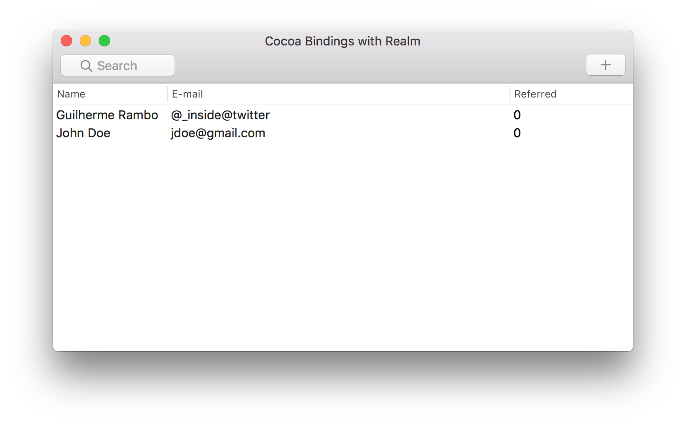

# Using Cocoa Bindings with Realm

This small sample app demonstrates how you can take advantage of Cocoa Bindings when using Realm on macOS projects, creating UI to manage models without writing any glue code.

To learn more, [read my article on this topic]().



Building the app requires [Carthage](https://github.com/Carthage/Carthage) to be installed.

In the project directory, run:

```bash
carthage update
```